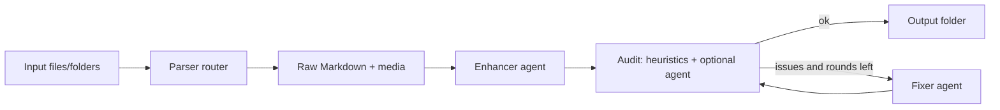

# docmd-graph

`docmd-graph` converts PDFs, Word documents, image batches, and mixed folders into a clean Markdown package:

```text
output/
  blabla.md
  media/
    ...images referenced by blabla.md...
```

The pipeline is intentionally agentic but not agent-only. It first uses deterministic parsers, then optionally asks a coding agent to improve Markdown and media, then audits the result against source screenshots and extracted media, then lets a fixer agent repair problems. The audit/fix loop runs at most two times by default.

All prompts shipped with this package are in English.

## Why this shape

PDF and image conversion is not a single-tool problem. Born-digital PDFs, scans, screenshots of lab results, DOCX files, and messy office exports fail in different ways. This library routes each input through a parser stack, then uses an agent only where judgment helps: restoring readable Markdown, preserving important data, and catching regressions.

## Install

```bash
uv venv --python 3.11
uv sync --extra all --extra dev

# macOS: pandoc for Office/DOCX parsing, LibreOffice for audit screenshots
brew install pandoc libreoffice
```

Other useful external tools:

```bash
# macOS
brew install poppler tesseract

# Ubuntu/Debian
sudo apt-get update
sudo apt-get install -y pandoc poppler-utils tesseract-ocr libreoffice
```

Agent CLIs are optional. Without them, the pipeline still parses, normalizes media links, and runs heuristic audit checks.

```bash
# Codex CLI, then authenticate as instructed by Codex
codex login

# Cursor CLI, then authenticate as instructed by Cursor
cursor-agent login
```

## Quick start

```bash
# Parser + heuristic audit only
docmd convert ./scan.pdf ./photo.jpg --out ./output --agent none

# Use Codex for enhancement, audit, and fixing
docmd convert ./scan.pdf ./photo.jpg ./report.docx \
  --out ./output \
  --agent codex \
  --output-name blabla.md

# Use Cursor Agent instead
docmd convert ./input-folder --out ./output --agent cursor
```

The default output is:

```text
output/
  blabla.md
  media/
```

Use `--keep-workdir` to keep parser raw output, screenshots, prompts, and audit logs:

```text
output/
  blabla.md
  media/
  _work/
    raw.md
    parser_results.json
    screenshots/
    prompts/
    audit_round_0.json
```

## CLI

```bash
docmd convert INPUT... [OPTIONS]
```

Important options:

```text
--out PATH                    Output folder.
--output-name TEXT            Markdown filename. Default: blabla.md.
--agent none|codex|cursor     Agent backend. Default: none.
--parser auto|pymupdf4llm|pandoc|markitdown|docling|image
--max-fix-rounds INTEGER      Default: 2.
--ocr / --no-ocr              Enable best-effort Tesseract OCR for image files.
--ocr-languages TEXT          Default: eng+rus.
--keep-workdir                Keep _work/ for debugging.
--fail-on-audit               Exit non-zero when final audit is not OK.
--model TEXT                  Agent model override.
```

## Architecture



LangGraph controls this flow with a shared state object and a conditional edge after the audit node. The graph route is:

```text
parse -> enhance -> audit -> END
                       \-> fix -> audit -> ...
```

## Parser routing

Default `--parser auto` tries these parsers by extension:

| Input | Parser order |
|---|---|
| `.pdf` | PyMuPDF4LLM → Docling → MarkItDown |
| `.docx`, `.odt`, `.rtf` | Pandoc → MarkItDown → Docling |
| `.pptx`, `.xlsx`, `.html` | MarkItDown → Docling → Pandoc |
| `.png`, `.jpg`, `.jpeg`, `.tif`, `.tiff`, `.webp`, `.bmp` | Image parser → MarkItDown → Docling |
| `.md`, `.txt` | Plain text parser |

A parser failure does not stop the whole run until every candidate parser for that file has failed.

## Agent backends

### Codex

The Codex adapter calls `codex exec` in non-interactive mode. It uses:

```bash
codex exec \
  --cd <workdir> \
  --skip-git-repo-check \
  --sandbox workspace-write \
  --ask-for-approval never \
  --color never \
  -
```

For audit tasks it uses `--sandbox read-only`. Reference screenshots and source images are attached with `--image` when supported.

### Cursor

The Cursor adapter calls Cursor Agent in print/headless mode:

```bash
cursor-agent --print --output-format text --workspace <workdir> --trust [--force] "Read and follow ..."
```

For editing tasks it adds `--force` so the command can run without interactive prompts. Override the executable with `--cursor-bin agent` when your installation exposes the binary as `agent` instead of `cursor-agent`.

## Safety model

The fixer prompt tells the agent to edit only:

```text
<output>/blabla.md
<output>/media/**
```

Codex additionally uses `workspace-write`, not full-access, by default. Cursor is constrained by the workspace path and prompt instructions. For stricter production isolation, run this library in a container and mount only the input files and output folder.

## Programmatic API

```python
from pathlib import Path
from docmd_graph import RunConfig, convert

result = convert(
    inputs=[Path("scan.pdf"), Path("photo.jpg")],
    output_dir=Path("output"),
    config=RunConfig(agent="codex", output_name="blabla.md"),
)

print(result.markdown_path)
print(result.audit_report.ok)
```

## Lab-result photos

For photos or scans of medical/lab results, the prompts are designed to transcribe visible text, values, units, and reference ranges without giving medical advice. The Markdown may include `[unclear]` markers when the source is not readable enough. This package is a conversion tool, not a diagnostic or medical interpretation tool.

## Development

```bash
uv sync --extra all --extra dev
uv run pytest
uv run ruff check .
```

## Current limitations

- Agent vision support depends on the backend. Codex supports image attachments; Cursor support depends on the installed agent version and how it handles local image paths.
- DOCX/PPTX screenshots require LibreOffice/soffice. Without it, the audit still checks Markdown and media links but cannot visually compare Office layout.
- OCR for standalone images is best-effort through local Tesseract when `--ocr` is enabled.
- Exact visual layout preservation is not the goal; readable Markdown with preserved information is.
